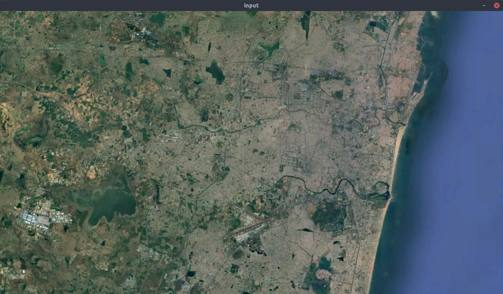
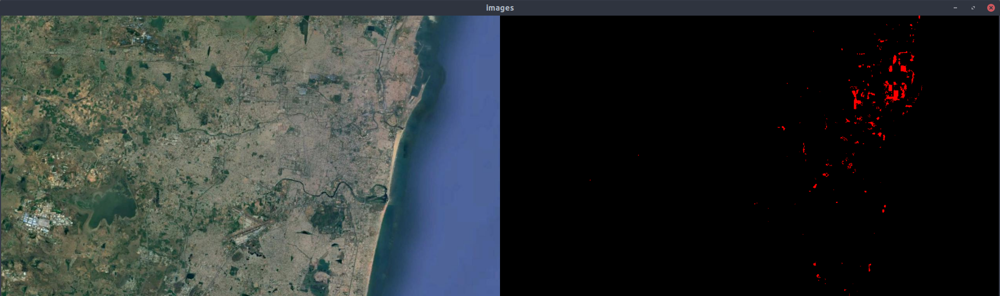
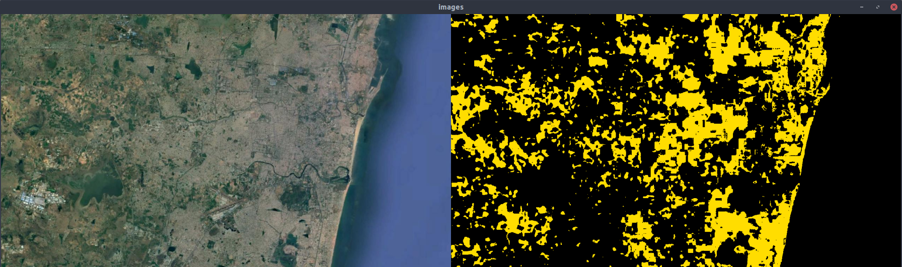
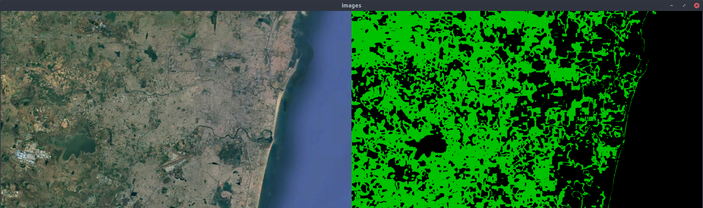
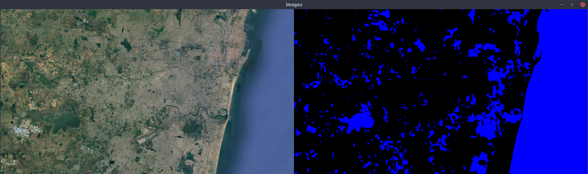
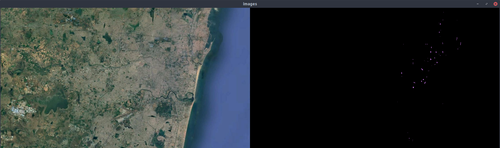
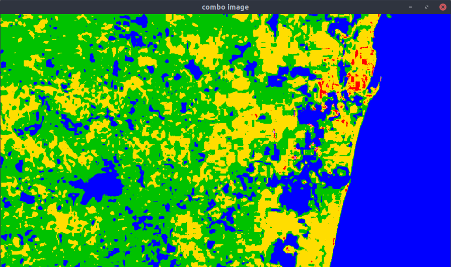

# Python-Color-Identifier
Python code to demarcate colours in an image with HSV ranges

## What does it do?
The tool can read through an image pixel-by-pixel and generate a color map by mapping different pixels to their nearest color neighbour based on the boundaries defined in the code (with reference to ```hsvChart.png```).

## Branch Info
```master``` = Generate processed image as RGB output in a window

```gen_img_file``` = Generate processed image as simplified json array

## How to use it?
### Step 1
Install openCV by running the following on your command line
```
sudo apt update
sudo apt install python3-opencv
```
Test if the installation is successful by running
```
python3 -c "import cv2; print(cv2.__version__)"
```
It should return an output mentioning the version number of openCV being used on the system.

### Step 2
- Clone the repository onto your local machine.
```
python3 colorIdentification.py --image <path_to_image>

Example (for this repo):
python3 colorIdentification.py --image ../sampleData.jpg
```

## Input
 

## HSV Based Color Identification Process
 
 
 
 
 

## Output

